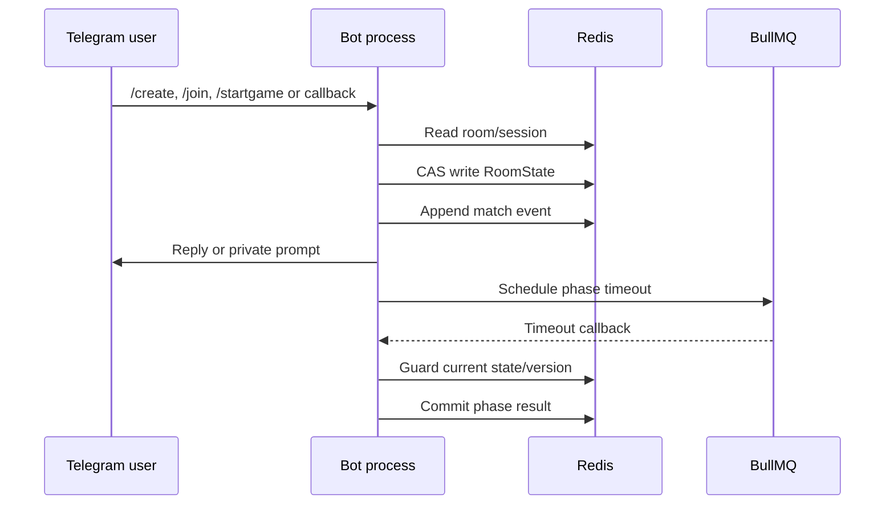

# BOT_OPERATIONS

> **Mục đích:** runbook vận hành và xử lý sự cố cho Werewolf Telegram Bot.  
> **Audience:** operator, support, QA, developer on-call.  
> **Operating model:** Telegram polling + Redis + BullMQ + HTTP health endpoint.

## 1. Service profile

| Property | Current value |
|---|---|
| Process | Node.js application compiled from TypeScript |
| Entry point | `src/index.ts` in development; `dist/index.js` after build |
| Telegram mode | Telegraf long polling |
| Required state store | Redis |
| Delayed jobs | BullMQ, backed by the same Redis deployment |
| Health endpoint | `GET /health` |
| Default HTTP port | `3001` |
| Web dashboard | Not present in current runtime |
| External admin login | Not present in current runtime |

The health endpoint is intentionally small. A `200` response proves the HTTP listener is alive, but operators must also check Telegram launch and Redis/BullMQ logs before declaring the service healthy.

## 2. Configuration checklist

| Variable | Required | Operational guidance |
|---|---:|---|
| `TELEGRAM_BOT_TOKEN` | Yes | Store in secret manager/environment only; never log or commit. |
| `REDIS_URL` | Yes | Use `redis://` or `rediss://`; verify network and TLS configuration. |
| `LOG_LEVEL` | No | `info` for normal operation; `debug` for incident reproduction. |
| `NODE_ENV` | No | Defaults to `development`; set explicitly in deployment. |
| `BOT_PORT` | No | Takes precedence over `PORT`; default `3001`. |
| `PORT` | Provider-specific | Used when `BOT_PORT` is not set. |
| `MUTE_DEAD_PLAYERS` | No | Defaults to `true`; controls dead-player message enforcement policy. |

The current repository does not use `DASHBOARD_*`, `JWT_SECRET`, `DATABASE_URL` or a web login configuration. Do not add those variables to a standard bot deployment unless a separately approved service is introduced.

## 3. Start, stop and health validation

Development start:

```bash
npm install
npm run dev
```

Production-like start:

```bash
npm ci
npm run build
npm start
```

Health validation:

```bash
curl -i http://localhost:3001/health
```

Expected response:

```http
HTTP/1.1 200 OK
Content-Type: application/json

{"status":"ok"}
```

Startup is complete only when the logs also show `Bot is up and running.` and `HTTP server listening on port ...`. The process should be stopped with `SIGINT` or `SIGTERM` so the HTTP server, Telegram polling, BullMQ scheduler and Redis client can close cleanly.

## 4. Telegram permissions

The bot must be added to the target group/supergroup. If the match uses mute/restrict behavior, the bot needs the Telegram administrator permission to restrict members. Telegram may reject operations for users who have left, were removed, or have an invalid participant ID.

Players must send `/start` in a private chat before `/join`. This is a platform constraint: the bot uses the `dm-reachable:{telegramId}` marker to avoid promising a role/action DM that Telegram will reject.

## 5. Operational flow



## 6. What to monitor

| Signal | Normal meaning | Warning sign |
|---|---|---|
| `Bot is up and running.` | Telegram polling launched. | Missing after process start or repeated transient retries. |
| `HTTP server listening...` | Health listener bound. | Port conflict or listener crash. |
| Redis policy log | `maxmemory-policy=noeviction`. | Managed provider rejects CONFIG or uses volatile eviction. |
| `PHASE_CHANGED` events | Expected lifecycle progress. | Repeated same transition or no event past deadline. |
| `CONCURRENT_MODIFICATION` | Usually transient retry. | Persistent spikes indicate contention or duplicate flows. |
| `STALE_BALLOT` | Old button correctly rejected. | Large volume may indicate UI refresh or callback delay issue. |
| `STALE_RESOLUTION` | Old prepared night result correctly rejected. | Repeated incidents require timer/orchestrator trace. |
| `Telegram delivery failed` | Side effect failed; state may still be committed. | Check bot permissions, user DM and network. |
| BullMQ timeout logs | Phase progressed or timeout was ignored. | Missing callbacks, duplicate callbacks or delayed queue. |

## 7. Redis operational model

The Redis adapter stores current room state, active-room index, player sessions, event logs, action deduplication markers, timer deadlines and DM reachability markers.

| Key pattern | Purpose | Safe operator action |
|---|---|---|
| `room:{roomId}` | Current serialized state | Inspect only during incident; do not hand-edit casually. |
| `rooms:active` | Active room index | Do not clear while games are running. |
| `session:{telegramId}` | Current player room | Clear only with room context. |
| `logs:{matchId}` | Match event audit | Read-only inspection is preferred. |
| `action-dedup:{roomId}:{actionId}` | At-most-once action guard | Do not delete mid-action without understanding retry impact. |
| `timer:{roomId}` | Absolute phase deadline | Compare with room state before changing. |
| `dm-reachable:{telegramId}` | Private chat prerequisite | Usually safe to leave; it is not game membership. |

`saveRoom` is atomic compare-and-swap through Lua. An operator should not “fix” a stuck game by writing JSON directly because that bypasses version and event invariants.

## 8. Timer and recovery runbook

The bot persists absolute deadlines before scheduling BullMQ jobs. A callback can arrive late or after the user has already advanced the phase, so the handler checks current state and ignores stale work. On startup, active rooms are scanned; missing deadlines are re-armed and overdue rooms are resumed according to current state.

| Situation | First response |
|---|---|
| Room in `DAY` after restart | Check whether discussion opening was in progress; bootstrap can resume into discussion. |
| Room in `DISCUSSION` past deadline | Check lifecycle and enforcement readiness; then inspect voting transition log. |
| Room in `VOTING` past deadline | Check ballot and execution callback. |
| Room in `NIGHT` past deadline | Check Witch sub-phase, pending actions and resolution version. |
| Repeated stale callbacks | Compare phase, round, deadline and room `version`; do not replay manually. |

## 9. Common incidents

### 9.1 `/vote` appears not to work

Use `/status` first. `/vote` is valid as an early skip from `DAY` or `DISCUSSION`, and it re-presents the active ballot in `VOTING`. It is intentionally rejected in `NIGHT`, `EXECUTION` and other phases. If a user is not in the locked game, the bot returns the not-in-current-game message.

### 9.2 Action button is rejected

Check private session, player alive state, current phase, role and target. A duplicate action ID, stale ballot, wrong role or target that died earlier is expected to be rejected. Do not treat a rejected callback as a Redis failure without checking the error code.

### 9.3 Player cannot speak

During active discussion, a silenced player's text/voice/sticker/GIF/animation is removed and may cause immediate death. During night, mute policy may affect group messages for all players. After `GAME_OVER` or when no active room exists, stale mute markers must not continue to enforce deletion.

The bot has no API that hides or deletes a Telegram group. If a user says the group disappeared, check Telegram member status, client archive/mute settings, bot restriction behavior and whether the user left the group before attributing the issue to the bot.

### 9.4 Player does not receive role or action DM

Confirm the player sent `/start` privately, `dm-reachable:{telegramId}` exists, the bot has a valid token and Telegram API requests are not timing out. The group state may already be committed even if a private delivery failed; record the incident with match ID and player ID.

### 9.5 Redis/BullMQ instability

Check Redis connectivity, memory, `maxmemory-policy` and network latency. BullMQ requires `noeviction` for durable delayed jobs. If a managed service rejects `CONFIG SET`, apply the policy in its provider settings and restart only after confirming the setting.

## 10. Incident procedure

Record the incident time, group/chat ID, match ID, round, state, user action, expected behavior, actual behavior and relevant log lines. Redact bot token, Redis credentials and private role content.

Then verify connectivity, capture `/status`, inspect room/event/timer state, trace the service caller and reproduce with a focused test. Avoid repeated restart, direct Redis edits or broad log deletion before evidence is captured.

## 11. Backup and retention

Current code writes match event lists but does not define an archive/retention policy for `logs:{matchId}`. Long-term backup, export destination, restore runbook and disaster recovery RPO/RTO are **CHƯA XÁC ĐỊNH** and require a deployment decision outside the source currently audited.

## 12. Security checklist

| Control | Current expectation |
|---|---|
| Bot token | Secret-only, never committed or logged. |
| Redis | Network-restricted; credentials/TLS managed outside source. |
| Host actions | `/startgame` and `/end` validate host identity. |
| Role actions | Engine checks role; callback payload alone is not trusted. |
| Web surface | Only health endpoint; no admin login or dashboard route. |
| Logs | Avoid exposing private role/action content. |
| Production access | Provider, TLS, reverse proxy and process manager are CHƯA XÁC ĐỊNH. |

## 13. Operational acceptance criteria

A deployment is operationally acceptable when it can start with secrets injected, connect to Redis, pass health check, launch Telegram polling, process `/start` and `/create`, schedule a timed phase, survive a graceful restart without corrupting room state, and produce actionable logs for delivery or phase errors.

## References

[1]: ../../src/index.ts "Bootstrap, middleware and recovery"
[2]: ../../src/telegram/BotServices.ts "Redis/BullMQ composition and policy"
[3]: ../../src/engine/RoomTimerService.ts "Timer persistence and scheduling"
[4]: ../../src/infrastructure/redis/RedisStorageAdapter.ts "Redis CAS and keys"
[5]: ../../src/telegram/MuteService.ts "Mute/unmute behavior"
[6]: ../../src/engine/errors/DomainError.ts "Operational error taxonomy"
