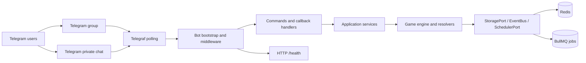
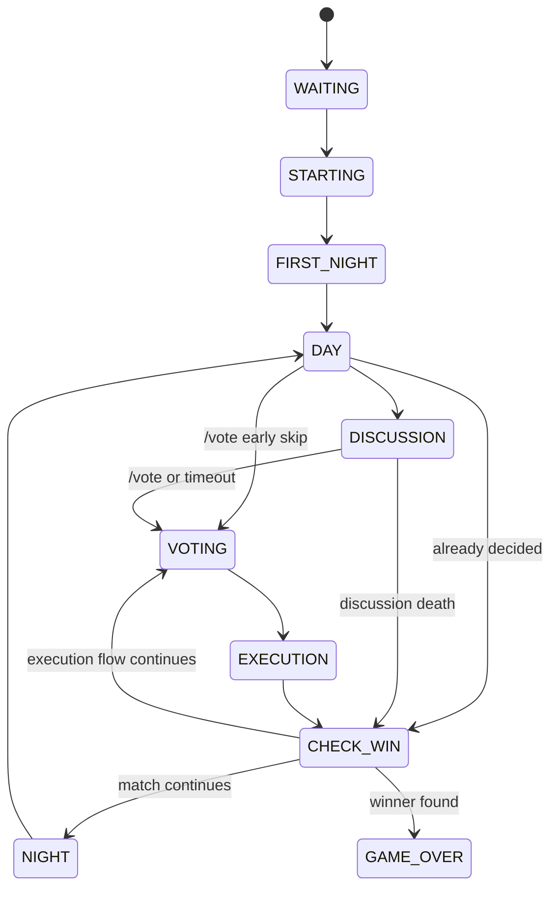

# Technical Architecture

> **Document status:** As-is architecture baseline  
> **Audience:** Product owner, solution architect, developer, operations  
> **System:** `werewolf-bot`  
> **Source of truth:** TypeScript source, tests and current configuration in this repository  
> **Important boundary:** The removed dashboard/login service is not part of the current runtime.

## 1. Executive summary

`werewolf-bot` is a TypeScript/Node.js Telegram bot that orchestrates a complete Werewolf match inside a Telegram group. The process receives Telegram updates through Telegraf polling, uses Redis as its operational persistence layer, uses BullMQ for delayed phase jobs, and exposes a minimal HTTP health endpoint. The design deliberately separates Telegram concerns from game rules so that role validation, phase transitions, voting and night resolution remain testable without a Telegram connection.

The runtime is stateful. A room has one authoritative serialized `RoomState`, while every match also has an append-only event stream keyed by `matchId`. Mutations use optimistic compare-and-swap, so concurrent joins, votes, timer callbacks and action submissions do not silently overwrite one another. The Telegram layer remains responsible for delivery and presentation; the engine remains responsible for legality and state mutation.

## 2. Document control and scope

| Item | Definition |
|---|---|
| Architecture type | Modular monolith with hexagonal/port-and-adapter boundaries |
| Primary transport | Telegram Bot API through Telegraf polling |
| Operational persistence | Redis via `RedisStorageAdapter` |
| Delayed work | BullMQ through `SchedulerPort` |
| Runtime health | `GET /health` on `BOT_PORT`/`PORT` |
| Current web UI | None; dashboard and login routes have been removed |
| Current database | No SQL database or ORM is used |
| Current scale assumption | One bot process per Telegram token; shared Redis enables safe CAS semantics if services are later scaled |

This document covers the current product behavior and technical boundaries. It does not define a future web dashboard, a future authentication portal, a hosting provider-specific deployment, or a database schema that is not present in source code.

## 3. System context

The bot operates in three contexts: a Telegram group where the public game is conducted, private Telegram chats where roles and night actions are delivered, and Redis/BullMQ infrastructure that holds room state and phase deadlines.



The current HTTP server is not a control plane. Every path other than `/health` falls back to the plain text response `Werewolf bot is running`. There is no browser login and no admin web API in the current implementation.

## 4. Layered architecture

### 4.1 Bootstrap layer

`src/index.ts` is the composition boundary for the running process. It loads configuration, creates `BotServices`, initializes Redis policy checks, creates the Telegraf instance, installs update-level error handling, installs the message mute/Silence Gate middleware, registers commands and callback handlers, registers timeout handlers, recovers active rooms, and starts the HTTP server plus Telegram polling.

### 4.2 Telegram adapter layer

The `src/telegram` tree translates Telegram updates into application calls and translates domain errors into Vietnamese user-facing messages. It includes commands, callback query handling, keyboards, presenters, mute handling and `GameFlowController`. This layer may call Telegram APIs, but it must not be treated as the authority for game legality.

### 4.3 Application layer

The core application services are:

| Service | Primary responsibility | State it owns or mutates |
|---|---|---|
| `RoomService` | Create/join/leave/kick/close room and player sessions | Membership, room status, player identity |
| `GameService` | Start match and assign roles | Match ID, roles, round initialization |
| `NightActionService` | Validate, persist and resolve night actions | Pending actions, deaths, potion state, night transition |
| `DayService` | Discussion, Silence Gate, ballot and execution | Discussion lifecycle, silence, vote state, execution |
| `GameOrchestrator` | Join the services to timers and Telegram prompts | Phase callback coordination |
| `RoomTimerService` | Persist deadlines and schedule/cancel jobs | Timer deadline and scheduled phase timeout |

### 4.4 Domain layer

`src/engine/domain` contains plain serializable models and enums. Role classes implement `IRole` and validate actions without mutating the room directly. `GameStateMachine` centralizes legal transitions. `DeathQueue`, `NightResolver`, `VoteResolver` and `WinConditionChecker` centralize result calculation.

### 4.5 Infrastructure layer

`RedisStorageAdapter` is the production implementation of `StoragePort`; `InMemoryStorageAdapter` is used by tests. `BullMqSchedulerPort` adapts delayed work. Winston provides process logging. The engine depends on ports rather than concrete infrastructure classes.

## 5. Dependency and request flow

A public command follows this path:

```text
Telegram update
  → Telegraf middleware
  → command handler
  → application service
  → domain validation/resolution
  → Redis CAS save
  → append/publish domain event
  → Telegram response or phase prompt
```

A night callback follows the same boundary but is initiated by a private callback query. A message that may violate Silence Gate is intercepted earlier by middleware and is accepted only when the room is in active discussion and the enforcement gate is ready.

## 6. State machine and lifecycle

The authoritative transition table is in `GameStateMachine.ts`.



`STARTING` is an instantaneous bookkeeping state. `DAY` is a hand-off state that may exist while dawn is announced and discussion is opened. `GAME_OVER` is terminal. Any attempted transition outside the table throws `INVALID_STATE_TRANSITION` rather than silently corrupting state.

## 7. Telegram interaction model

Public interaction consists of commands and group messages. Private interaction consists of role messages, night action keyboards, Hunter prompts and Seer results. The callback handler validates room session and action payload before calling the engine.

Vote callbacks and speech messages are intentionally separate flows. A vote callback contains a ballot identity and reaches `DayService.submitVote`; it does not pass through the speech Silence Gate. A speech event is a group text, voice, sticker, GIF or animation message and is evaluated only during active discussion.

## 8. Data model and persistence

The current room snapshot contains membership, match lifecycle, player state, pending actions, current ballot, discussion lifecycle, silence metadata, potion state and timer-related fields. Each save increments a monotonic `version`.

| Data | Redis representation | Consistency expectation |
|---|---|---|
| Current room | `room:{roomId}` JSON | CAS write required |
| Active room index | `rooms:active` Set | Must match live room lifecycle |
| User session | `session:{telegramId}` string | Single current room per user |
| Match events | `logs:{matchId}` List | Append-only audit trail |
| Action dedup | `action-dedup:{roomId}:{actionId}` with TTL | At-most-once logical submission |
| Phase deadline | `timer:{roomId}` epoch ms | Used by recovery and timeout guard |
| DM reachability | `dm-reachable:{telegramId}` marker | Required before proactive DM |

`saveRoom` uses a Lua compare-and-swap script. The adapter reads the current version inside the atomic script and rejects stale writes with `CONCURRENT_MODIFICATION`. This protects the room from lost updates when multiple Telegram updates arrive close together.

## 9. Night resolution architecture

Night resolution is deliberately split when a Hunter revenge decision requires an interactive prompt. `prepareNightResolution` calculates the original deaths and returns pending Hunter IDs without mutating final player state. The Telegram layer collects decisions, then `finalizeNightResolution` verifies the room version before applying deaths, Hunter decisions, silence, potion state and transitions.

The ordered pass is driven by `room.settings.nightActionOrder`. The current resolver recognizes Werewolf kill, Bodyguard protect, Seer inspect, Witch save, Witch poison and Silent Mage silence. Bodyguard and Witch save protect against the Werewolf kill, not against unrelated death causes. Seer results are computed before final death application, so a Seer killed in that night can still receive the result.

## 10. Day, Silence Gate and vote architecture

`DayService.startDiscussion` creates a discussion cycle in `OPENING` and sets enforcement false. `GameFlowController` sends the opening announcement. Only after delivery succeeds does the flow activate the discussion, persist its deadline and set `discussionEnforcementReady` true.

A non-command message is classified as `TEXT`, `VOICE`, `STICKER`, `GIF` or `ANIMATION`. If the active target is silenced, the service atomically kills that player with `SPOKEN_WHILE_SILENCED`, checks the win condition and returns a result for Telegram cleanup/announcement. If no violation is found, the message continues through the normal update chain.

Voting uses `ballotId`, `voteTarget` and `hasVotedThisRound`. A stale button from a previous ballot is rejected. A duplicate vote is rejected. Dead players cannot vote. A null target is an explicit skip rather than an absent submission.

## 11. Timers, jobs and recovery

`RoomTimerService` writes an absolute deadline to Redis and schedules a BullMQ job. When a phase completes early, the in-process job is cancelled and the persisted deadline is cleared. At startup, the bootstrap enumerates active rooms, re-arms missing deadlines and resolves overdue rooms according to their state.

Timer callbacks are untrusted with respect to current state: a callback may have been delayed, duplicated or delivered after a user action. Therefore callbacks must verify current state, round, sub-phase, discussion cycle or ballot before mutation. A stale callback is logged and ignored.

## 12. Error handling and failure domains

Domain errors are platform-agnostic and translated by the Telegram presenter. Typical errors are invalid phase, dead player, invalid target, wrong role, duplicate action, stale ballot, stale resolution, concurrent modification and DM prerequisite. Delivery failures are side effects: when a Telegram message fails after state commit, the engine does not pretend that the transaction rolled back.

Startup retries transient Telegram errors with bounded exponential backoff. Redis initialization validates BullMQ's `noeviction` requirement and emits an actionable error if a managed provider does not allow the setting to be changed.

## 13. Security boundaries

The bot token and Redis credentials are environment secrets. Host authorization is based on `hostTelegramId`; role/action authorization is based on the role in `PlayerState`, not on button data alone. Callback IDs, room IDs and player IDs are validated at the service boundary. The current system has no web login, JWT, session cookie or dashboard authentication surface.

## 14. Observability

The current observability baseline is Winston console logging plus match event lists in Redis. Important log context includes `roomId`, `matchId`, `gameState`, `currentRound`, `updateId`, player ID and action type. Persistent metrics, tracing, external error monitoring and a web dashboard are not part of the current runtime.

## 15. Architecture decisions and non-goals

| Decision | Rationale |
|---|---|
| Engine depends on ports | Allows in-memory testing and prevents Telegram/Redis coupling. |
| Room state is serialized | Safe Redis round-trip and straightforward recovery. |
| CAS via Lua | Avoids read/write race windows. |
| Events are append-only | Provides match audit history without replacing current state. |
| Timers persist absolute deadlines | Enables restart recovery instead of resetting every phase. |
| Interactive Hunter resolution is split | Prevents finalizing a room before a real prompt is answered. |
| No dashboard in current boundary | Dashboard/login was removed; HTTP is health-only. |

## 16. Traceability matrix

| Requirement area | Source of truth | Verification focus |
|---|---|---|
| Bootstrap and commands | `src/index.ts`, `src/telegram/commands` | Start-up, command registration, health |
| Room membership | `RoomService.ts`, `Room.ts` | Sessions, lock, leave/close |
| Role assignment | `GameService.ts`, `RoleAssigner.ts`, `RoleDistributionStrategy.ts` | Count and random assignment |
| State transitions | `GameStateMachine.ts` | Allowed/forbidden transitions |
| Night rules | `NightActionService.ts`, `NightResolver.ts`, `DeathQueue.ts` | Target, order, death chain |
| Day and Silence Gate | `DayService.ts`, `src/index.ts` | Opening gate, speech violation, immediate win check |
| Voting | `VoteResolver.ts`, `actionCallbackHandler.ts` | Ballot identity, duplicate/stale callback |
| Persistence | `StoragePort.ts`, `RedisStorageAdapter.ts` | CAS, events, TTL markers |
| Operations | `BotServices.ts`, `RoomTimerService.ts` | Redis policy, timers, recovery |

## References

[1]: ../../src/index.ts "Runtime bootstrap and Telegram middleware"
[2]: ../../src/telegram/BotServices.ts "Composition root and Redis/BullMQ initialization"
[3]: ../../src/engine/GameService.ts "Match lifecycle and role assignment"
[4]: ../../src/engine/NightActionService.ts "Night action validation and finalization"
[5]: ../../src/engine/night/NightResolver.ts "Ordered night resolution"
[6]: ../../src/engine/DayService.ts "Discussion, Silence Gate and voting"
[7]: ../../src/engine/state-machine/GameStateMachine.ts "Legal phase transitions"
[8]: ../../src/infrastructure/redis/RedisStorageAdapter.ts "Redis CAS and persistence"
[9]: ../../src/engine/domain/Room.ts "RoomState and GameSettings"

> **CHƯA XÁC ĐỊNH:** Hosting provider, TLS/reverse proxy, SQL database, web admin authentication, external metrics, event-log retention dài hạn và SLA/RPO/RTO không thuộc contract của source hiện tại.
